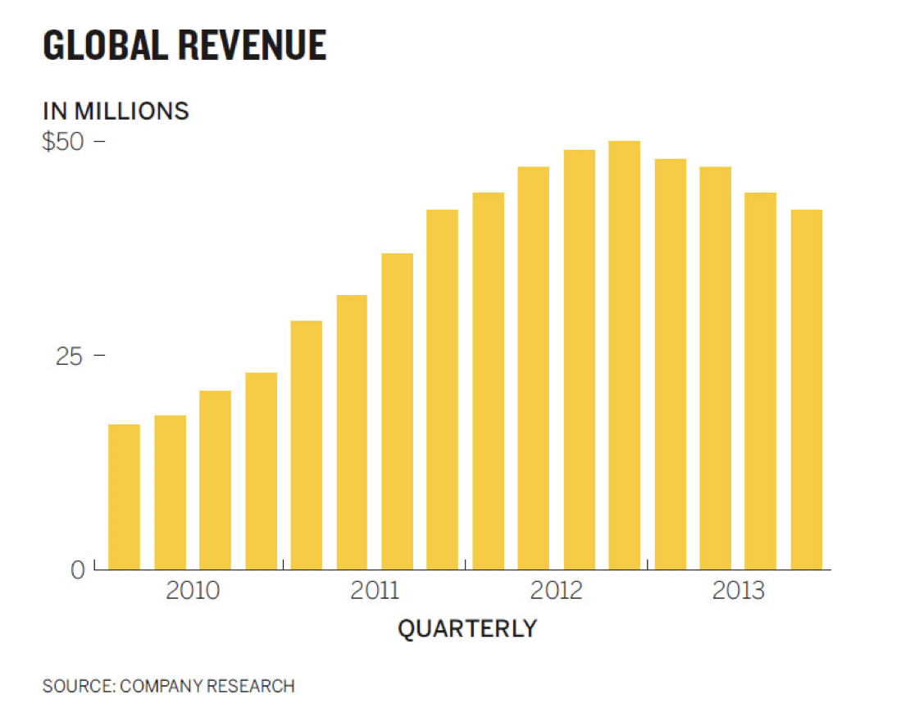
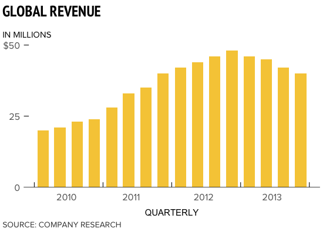

# Good Charts Bar Chart

In this data viz example, I've attempted to replicate the following chart from [Good Charts: The HBR Guide to Making Smarter, More Persuasive Data Visualizations](https://www.amazon.com/Good-Charts-Smarter-Persuasive-Visualizations/dp/1633690709):

Here's the result:

